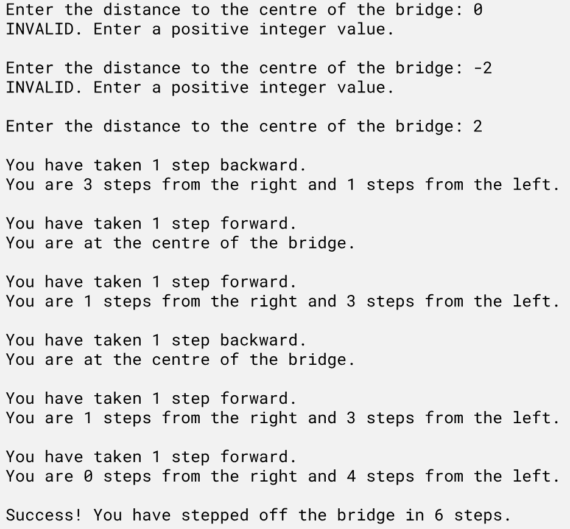

# Unit 4 Review - Random Walk Problem

In the Random Walk problem, a person is placed at the center of a bridge. Each step the person moves 1 meter either forward or backward at random. 

**<ins>Your Task:</ins>** 
Create a program that determines how many steps the person will walk before taking a step off either side of the bridge.

**NOTE:** Program source code must make use of **conditions**, **loops**, and **at least one function**.

## Description
### Requirements:
1. Prompt the user to enter an integer value that represents the distance to the center of the bridge from either the left or right side.
2. Validate that the number entered in a positive integer value greater than zero.
3. Repeatedly simulate the person moving on the bridge until the person steps off the bridge. HINT: Generate the random numbers 0 and 1, with 0 meaning to go forward (i.e. towards the right) and 1 meaning to go backward (i.e. towards the left).
4. Display a summary of each move that indicates the move direction and the number of steps away from the right and left side of the bridge.
5. Tally the total number of steps the person had to take to step off either side of the bridge
6. Your code must include proper internal documentation (i.e. header, comments, docstrings), meaningful variable names, and proper spacing and indentation

### Sample Output:
